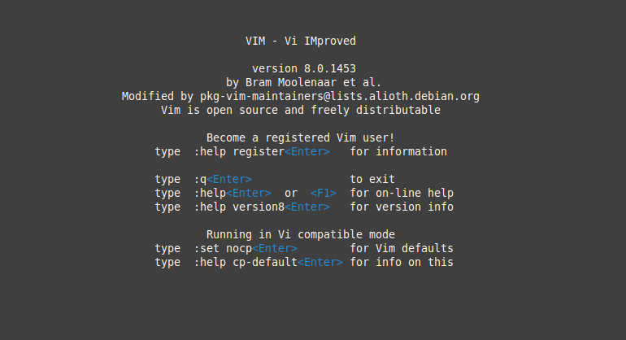

### VI TUTORIAL

In this tutorial you will learn basic commands
when using Vi in Linux

There are two modes when using vi:

- Command Mode
- Text Mode

The first thing you wnat to understand is that it will be tricky to know when
you are in command mode, so just press **[ESC]** twice.
And for sure you will be in command mode.

So to open vi textt editor, you just write vi <your file name> and hit enter.

Then when the file opens, you will be in command mode,
so to start editing the document you will have to press "I"
and you will be in "Text Mode"

Unfortunately, this editor does not behave like the editors we already know,
it will seem difficult at the beginning getting use to it. I found out useful
to just type, and if I made a mistake just get into **COMMAND MODE**
( **[ESC]** twice ) and then use the keyboard for editing.

One thing I believe you will like is to add Line Numbers in the document when
editing, it will make it easier to directly move to the line number and do
whatever you want to.

For that you need to be in COMMAND MODE and then type : set number

The main commands you want to learn so you can navigate easier in the document
while in COMMAND MODE are:

+ k -> Move up one character
+ j -> Move down one character
+ h -> Move left one character
+ l -> Move right one character
+ w -> Move forward one word
+ b -> Move to the start of the word
+ e -> Move to the end of the word
+ ^ -> Move to the beginning of the line
+ $ -> Move to the end of the line
+ x -> Delete a single character
+ dd -> Delete the entire current line
+ :x -> The colon followed by a number would position the cursor on the line represented by x

While in **COMAND MODE**, and you want to get in INSERT MODE, you can use the
following:

+ i -> At the cursor
+ a -> After the cursor
+ I -> Before the current line
+ A -> After the current line
+ o -> Insert a new line after the current line

Then to save or quit, you need to get into **COMMAND MODE**, and use the following:

+ q -> Quit
+ q! -> Quit without saving changes
+ wq -> Write and quit (save and quit)

I hope this was useful for you to understand!

The followig are the links of helpful websites if you want to learn more in deep about vi:

- [Tutorials Point Website](https://www.tutorialspoint.com/unix/unix-vi-editor.htm)
- [Ryans Tutorial](https://ryanstutorials.net/linuxtutorial/cheatsheetvi.php)
- This helpful sheet: [vi Cheat Sheet](./viCheatSheet.pdf) was found at: https://www.cheatography.com/adzz/cheat-sheets/vi-editor/pdf/

Also, I found a video:

- [YouTube Vi Tutorial](https://www.youtube.com/watch?v=HMpB28l1sLc)

